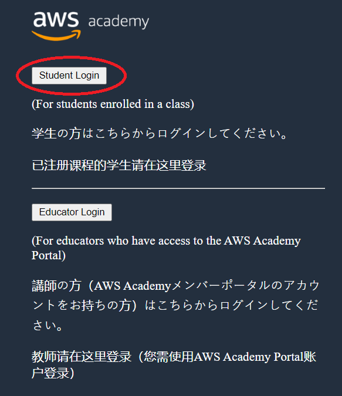

# Disciplina Computação em Nuvem - Universidade Federal do Ceará - Campus Quixadá

Autor: [Emanuel Coutinho](https://github.com/emanuelcoutinho)

Com a ajuda do Prof. [João Marcelo](https://github.com/jmhal) !!!
O material disponível neste repositório foi baseado na metodologia de aula do Prof. [João Marcelo](https://github.com/jmhal).

## Atividades da Disciplina

Lista de atividades a serem entregues pelos alunos.

## Links de apoio:

[AWS Academy](https://www.awsacademy.com/LMS_Login)

[AWS-LABS](https://github.com/thyagomota/aws-labs) - Autores: [Thyago Mota](https://github.com/thyagomota) e [João Marcelo](https://github.com/jmhal)

